# Building a Drone

Welcome to **Abu Villa** world of drone building! Crafting your own drone is not just a technical endeavor;  its a journey of creativity, innovation, and hands-on learning. In this guide, we`ll walk you through the exciting process of assembling your very own 5-inch drone.

# Parts List

| Component      |								 | Links                |
|----------------|-------------------------------|-------------------------|
|Frame			 |SpeedyBee Master 5 V2			 |		https://www.amazon.com/gp/product/B0CB6BTR4Z/ref=ewc_pr_img_1?smid=A1CA0481MF6RWW&psc=1		           |
|FC & ESC (stack)|SpeedyBee V3 F7 Stack			 |https://www.amazon.com/gp/product/B0B5QYXJNT/ref=ewc_pr_img_6?smid=A1CA0481MF6RWW&psc=1		          |
|Motors          |iFlight XING2 2306 1755KV 6S	 |https://www.amazon.com/gp/product/B0925DSVW2/ref=ewc_pr_img_10?smid=APE1PBQE6ZIBF&psc=1	           |
|Propellers      |Gemfan Hurricane               |https://www.amazon.com/gp/product/B09C8BZ27H/ref=ewc_pr_img_7?smid=A1DSGSQT9B8Q93&psc=1		           |
|Battery         |Gaoneng LiPo Drone Battery 1850mah 6S 100c XT-60					             |https://shopee.ph/Gaoneng-(GNB)-LiPo-Drone-Battery-1850mah-6S-100c-XT-60-i.59088184.12560887187?publish_id=&sp_atk=9a9aaaf1-2442-472e-bcd2-a91571376eca&xptdk=9a9aaaf1-2442-472e-bcd2-a91571376eca|
|GPS Module      |BN-220 Dual GPS Glonass Module |https://www.amazon.com/gp/product/B07PRDY6DS/ref=ewc_pr_img_6?smid=A1GUQD3SRXOFFI&th=1	           |
|Receiver        |RadioMaster RP1 2.4ghz w/ ELRS |https://www.amazon.com/gp/product/B0B93TCRGW/ref=ewc_pr_img_4?smid=A2TG3KYTBNKR2F&psc=1	           |
|Transmitter     |RadioMaster TX16S 2.4GHz		 |https://www.amazon.com/RadioMaster-TX12-EdgeTX-Multi-Module-2%EF%BC%88ELRS%EF%BC%89/dp/B0BFH5H14V/ref=sr_1_4?crid=1Q0J5M3FXWRK6&dib=eyJ2IjoiMSJ9.mBkiOj_RhH0MLO7cMcUaq6UNN1JV2Rhtj6hY6vFbahJQ-Imsuiu-sCq7TGOknp_cvyazT9Ppvqt_a4EAyhH2p9mpesTUj0p3l14xy8xHz6fB-QrG3eJWaNJRMJgMjKmmjyEWaGRUEl1ktBoBDF5lmlbYPRPfDk6aST_LiVtbZOJp4Tbr4Vyy_1Tmi469o_UKa6aTznqkiA8TKXdL-ZdbDQRJwVv2773tAzbIaRlKAvnfNSj5-GRansPB2hqqIWHcqoFKboDfVbLXtgrOLsJhNbkVLE8yCHoEs5CHfGtiCQY.uf8WPytaII5n0OTFKscd2be6HrkesxFIH6RcqoxfhCA&dib_tag=se&keywords=radiomaster+tx12&qid=1718251797&sprefix=Radio+Master+tx1%2Caps%2C295&sr=8-4	           |
|Goggles         |Skyzone Cobra X Goggles		 |https://www.amazon.com/Skyzone-1280x720-RapidMix-Receiver-Goggles/dp/B0CCNKNK9G/ref=sr_1_1_sspa?crid=SB96X8U3UVS3&dib=eyJ2IjoiMSJ9.9EBwDdKSKzPStXBGHrks370MxmgTaX17_B6zoIVZNExBgmcG7Ao4TlDMAf8SBdnP.z7WV0Ds62JTvMUieGKrjP1ql0Y2hX4qgHBQ896ObDlc&dib_tag=se&keywords=skyzone+cobra+x&qid=1718251843&sprefix=skyzone+cobra+x%2Caps%2C295&sr=8-1-spons&sp_csd=d2lkZ2V0TmFtZT1zcF9hdGY&psc=1	           |
|VTX             |AKK X2-Ultimate 5.8GHz		 |https://www.amazon.com/gp/product/B07DPG5H1T/ref=ewc_pr_img_9?smid=ADP3MHCS3NLR7&psc=1				           |
|Antenna         |FPV Antenna Lollipop 5.8G      |https://www.amazon.com/Foxeer-Antenna-Lollipop-Quadcopeter-Multicopter/dp/B07D12XS6K/ref=sr_1_1_sspa?crid=3H40EROAFCYAP&dib=eyJ2IjoiMSJ9.Jt7L3QrOmSnwUyMs3tuZ9-BmRc3TePqGHvE7ZdBD6FcXQUNYMsyfc6D4JfBLkJQqEX24WSGeuaHKh2dSWdtqsdhLRk8n59sdYep0s2JFIVCvLzXIrJAdusf19crQ6sTzYA47eZ9VaX1ICErh8J8tOkfXc0JYkd7U3Ayw60a1NfjvqeOnRghX5iTaaz3RrXloiENvj9o4ScNyndPtPh-v5qbgz83JuRpap_hoNmbjP8o.AHQJoK3edZam7vw3gsF3BoA_SmVNuPlKPxlgoqI7wF8&dib_tag=se&keywords=lollipop+antenna&qid=1718251658&sprefix=lollipop+ante%2Caps%2C318&sr=8-1-spons&sp_csd=d2lkZ2V0TmFtZT1zcF9hdGY&psc=1|
|Camera          |RunCam Phoenix 2				 |https://www.amazon.com/gp/product/B0C2TK5JGR/ref=ewc_pr_img_8?smid=A1CA0481MF6RWW&psc=1	           |

## Steps of Building FPV Drone
 - ## SpeedyBee Master 5 V2 Frame
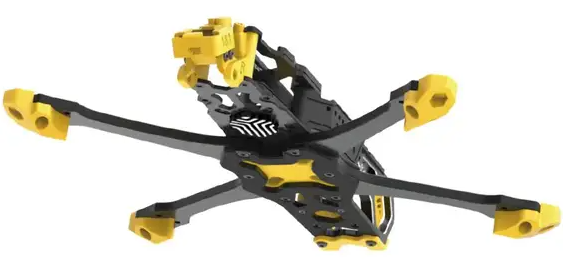

Installation Guidelines 

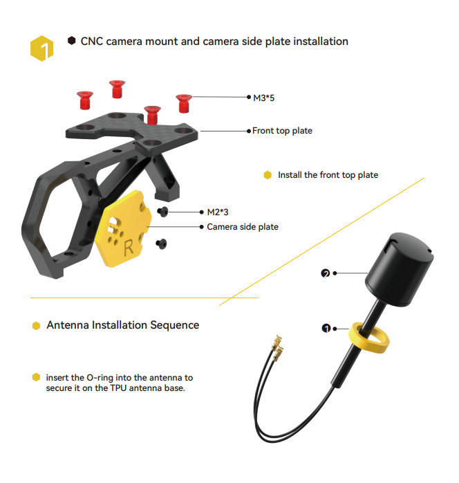
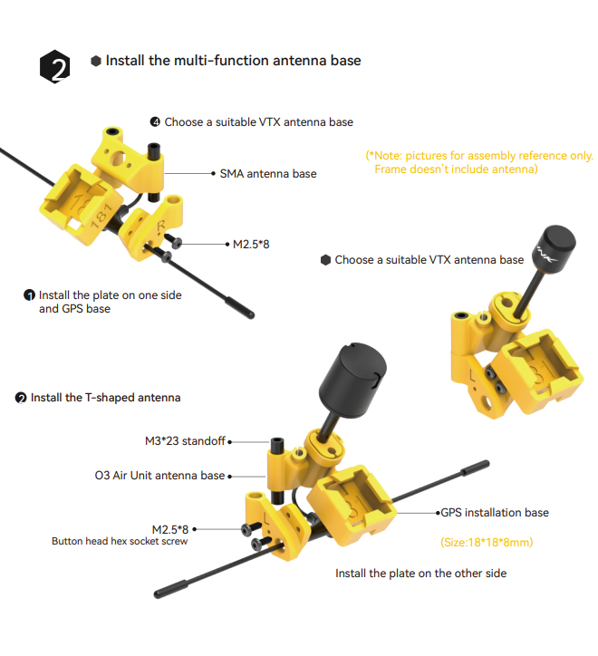
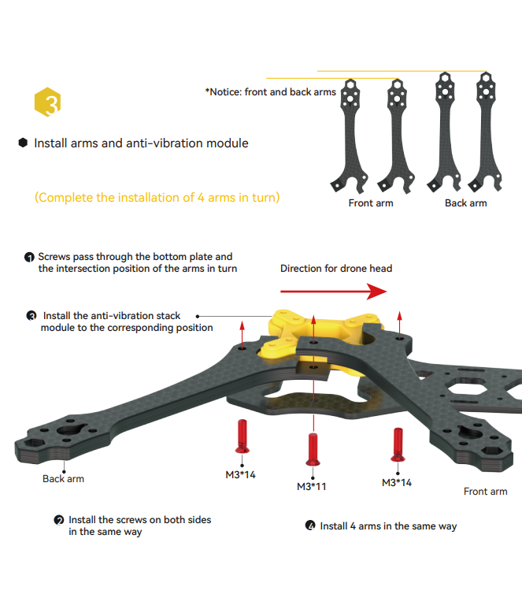
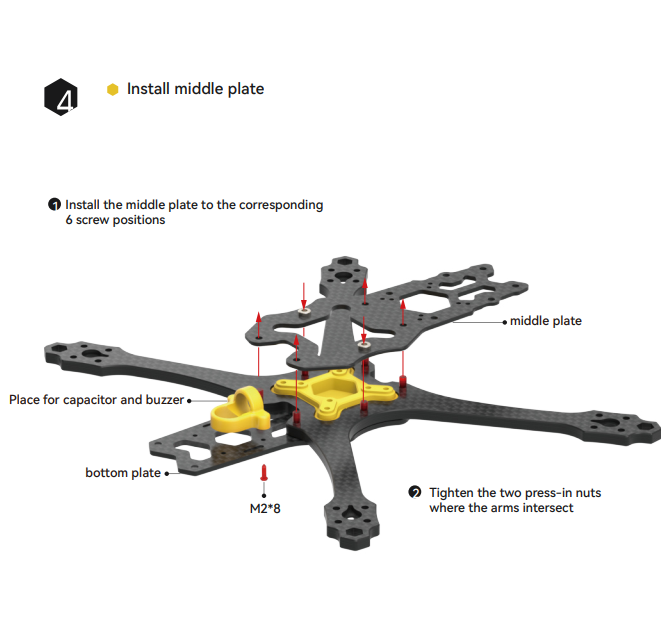
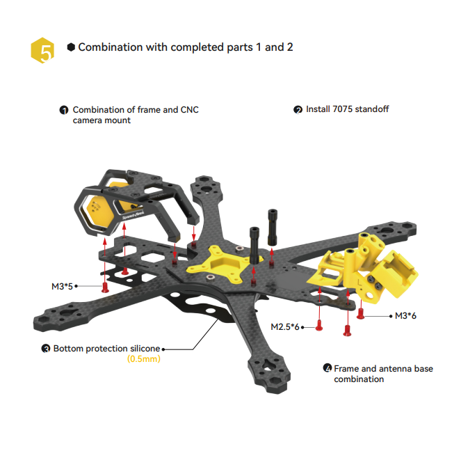
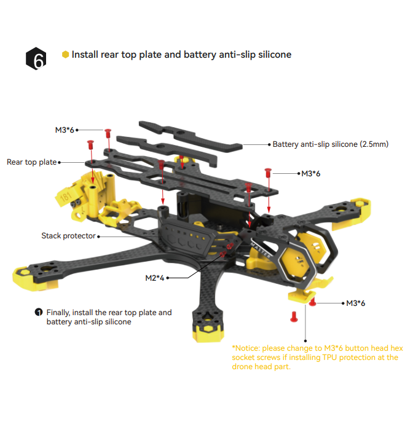
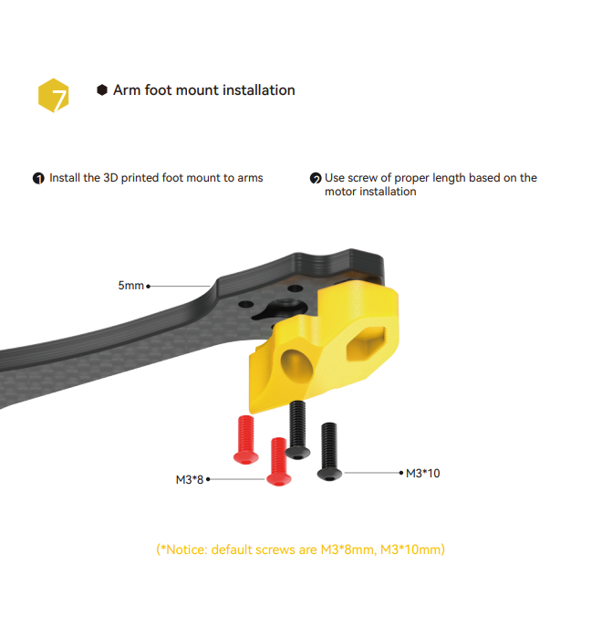
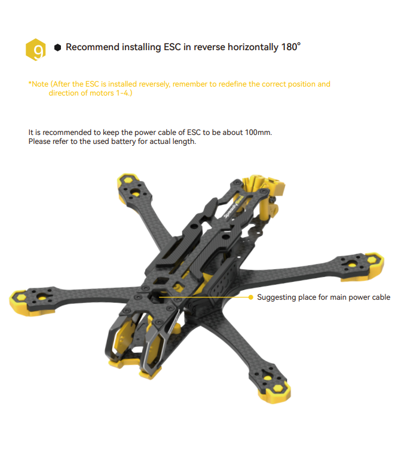

 - ## Wiring Diagram
Before proceeding, it’s a good idea to create a wiring diagram on a piece of paper outlining how to connect all the components. If you’re using the components I recommended, here are connection diagrams you can follow.
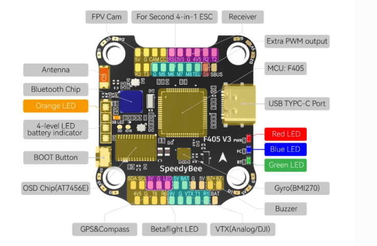

## 1. Installing ESC  
Begin by replacing the four shorter screws in the frame with the long M3 30mm bolts that come with the Speedybee F405 V3 stack. Avoid using nylon standoffs for installing FC, ESC and VTX, they break easily in crashes. Use metal bolts instead.
Use metal bolts for installing stack (with a metal nut at the botttom), it reduces vibration and wobble, makes the drone fly better and easier to tune.

- Slide the 4in1 ESC and FC boards onto the four long screws, ensuring the ESC board’s power pads face backward and the motor solder pads face up. The front of the frame is identifiable by the cut-outs for the camera mounting plates.
- Inspect the bottom of the ESC to ensure it’s not touching the frame. Additionally, check for any contact between the ESC and FC.
Next, you’ll do some soldering
## 2. Installing Motors 
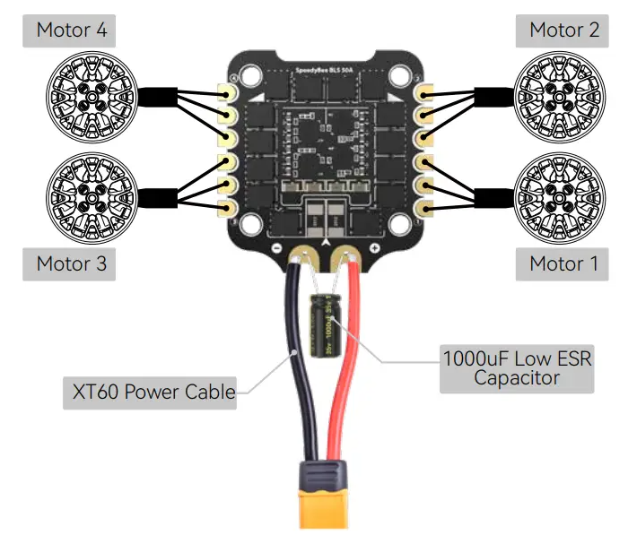 
- Determine the required motor wire lengths, leaving a little slack, and cut them accordingly. Secure the motor wires on the arms with cloth tape or electrical tape.
- Then, strip about 2mm off the tip of the wires and tin the ends.
- Using the trimmed off motor wires, solder two of them to the input power of the ESC (ideally on the bottom side). Mark the positive wires with a piece of tape to solder the capacitor to later. 
- Tin all the solder pads on the 4in1 ESC. To prevent solder from accidentally dropping onto the components and causing electrical shorts, cover the areas of the board where you’re not soldering with tape, such as electrical tape, kapton tape, or masking tape.

Solder the motor wires onto the ESC. Don’t worry about wire order and motor direction yet; you can change this later in the software. If you have the skills, you could try to solder motor wires side way, make it nicer to grab the quad.

Solder the XT60 power lead to the power pads on the ESC, making sure to maintain the correct polarity (positive and negative). This step may be challenging due to the amount of heat required to melt the solder on the large copper pads. Be patient and use a higher temperature on your iron.

Soldering Tips:
- Use a good amount of solder and solder flux (solder paste) for the large pads, ensuring the solder joints are shiny and full. If you can see the wire strands, you haven’t applied enough solder.
- Apply more flux if the solder “sticks” to the tip when you remove it from the joint.
- Feel free to use a high temperature when soldering large solder pads, but be quick and avoid overheating the pads for too long. Use 450°C (840°F) for motor wires and XT60, and 380°C for signal wires.
- Now solder the 1500uF capacitor that comes with the Speedybee stack. Bend and shorten the legs with pliers, then tin them with solder.
- Solder the capacitor to the wires connected to the ESC power pads earlier, being mindful of the polarity. The side with yellow marking is the negative side of the capacitor.

## 2. Installing Camera
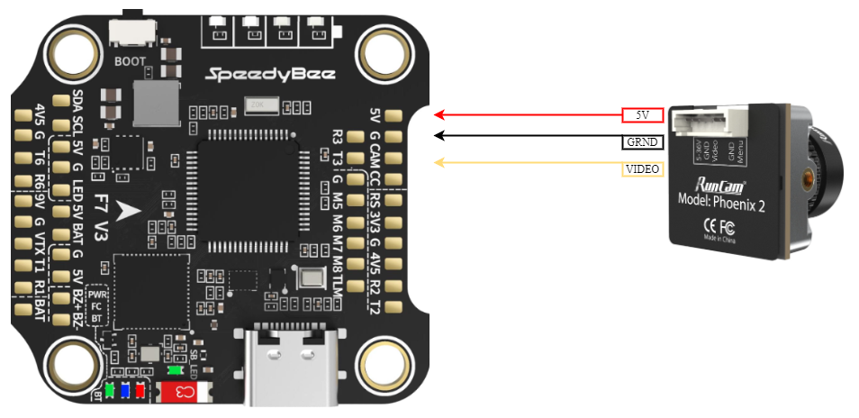
- Solder the CAMERA wires connect to the flight controller **5v, ground, cam** pads.

## 3. Installing GPS to Flight Controller
Wiring a GPS module to the flight controller is quite straightforward. Simply connect it directly to any available UART on the FC, (TX to RX, RX to TX), and power it with 5V.
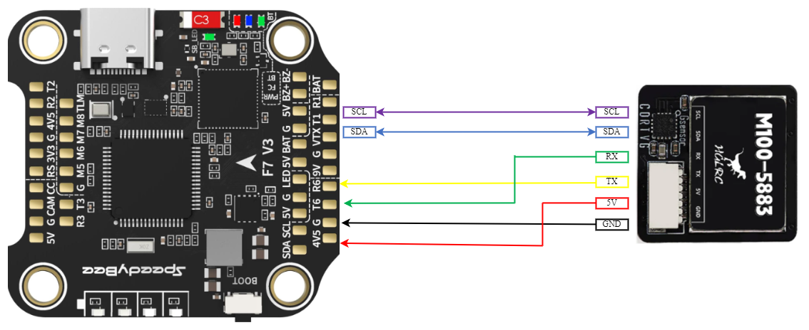
- Solder the **5v** wire of the gps to the **4v5** pad of the FC 
- Solder the **G** wire of the GPS to the **G** pad of the FC
- Solder the **TX** wire of the gps to the **T6** pad of the FC
- Solder the **RX** wire of the gps to the **R6** pad of the FC
- Solder the **SDA** wire of the gps to the **SDA** pad of the FC (if GPS has a compass/barometer) 
- Solder the **SCL** wire of the gps to the **SCL** pad of the FC (if GPS has a compass/barometer)

## 3. Installing Receiver
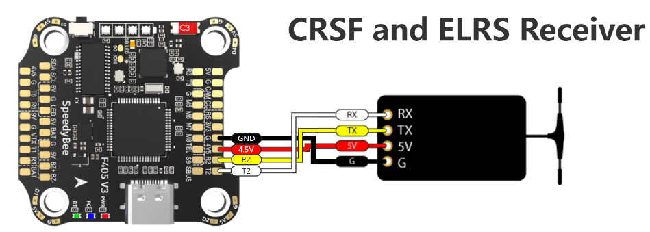
- Solder the **5v** wire of the receiver  to the **4v5** pad of the FC
- Solder the **G** wire of the receiver  to the **G** pad of the FC
- Solder the **RX** wire of the receiver  to the **T2** pad of the FC
- Solder the **TX** wire of the receiver  to the **R2** pad of the FC

## 3. Installing VTX
 

## Software

Inav is a flight control software, which was forked from Clean Flight. The software supports both multi-rotors and fixed wings and has good GPS modes like Return to launch (RTH) etc. The software has a mission planner, which allows for setting full autopilot GPS way-point navigation. It supports a variety of Flight controller boards and is actively being developed by the community.
 
## Switch to another file

All your files and folders are presented as a tree in the file explorer. You can switch from one to another by clicking a file in the tree.

## Rename a file

You can rename the current file by clicking the file name in the navigation bar or by clicking the **Rename** button in the file explorer.

## Delete a file

You can delete the current file by clicking the **Remove** button in the file explorer. The file will be moved into the **Trash** folder and automatically deleted after 7 days of inactivity.

## Export a file

You can export the current file by clicking **Export to disk** in the menu. You can choose to export the file as plain Markdown, as HTML using a Handlebars template or as a PDF.

# Synchronization

Synchronization is one of the biggest features of StackEdit. It enables you to synchronize any file in your workspace with other files stored in your **Google Drive**, your **Dropbox** and your **GitHub** accounts. This allows you to keep writing on other devices, collaborate with people you share the file with, integrate easily into your workflow... The synchronization mechanism takes place every minute in the background, downloading, merging, and uploading file modifications.

There are two types of synchronization and they can complement each other:

- The workspace synchronization will sync all your files, folders and settings automatically. This will allow you to fetch your workspace on any other device.
	> To start syncing your workspace, just sign in with Google in the menu.

- The file synchronization will keep one file of the workspace synced with one or multiple files in **Google Drive**, **Dropbox** or **GitHub**.
	> Before starting to sync files, you must link an account in the **Synchronize** sub-menu.

## Open a file

You can open a file from **Google Drive**, **Dropbox** or **GitHub** by opening the **Synchronize** sub-menu and clicking **Open from**. Once opened in the workspace, any modification in the file will be automatically synced.

## Save a file

You can save any file of the workspace to **Google Drive**, **Dropbox** or **GitHub** by opening the **Synchronize** sub-menu and clicking **Save on**. Even if a file in the workspace is already synced, you can save it to another location. StackEdit can sync one file with multiple locations and accounts.

## Synchronize a file

Once your file is linked to a synchronized location, StackEdit will periodically synchronize it by downloading/uploading any modification. A merge will be performed if necessary and conflicts will be resolved.

If you just have modified your file and you want to force syncing, click the **Synchronize now** button in the navigation bar.

> **Note:** The **Synchronize now** button is disabled if you have no file to synchronize.

## Manage file synchronization

Since one file can be synced with multiple locations, you can list and manage synchronized locations by clicking **File synchronization** in the **Synchronize** sub-menu. This allows you to list and remove synchronized locations that are linked to your file.

# Publication

Publishing in StackEdit makes it simple for you to publish online your files. Once you're happy with a file, you can publish it to different hosting platforms like **Blogger**, **Dropbox**, **Gist**, **GitHub**, **Google Drive**, **WordPress** and **Zendesk**. With [Handlebars templates](http://handlebarsjs.com/), you have full control over what you export.

> Before starting to publish, you must link an account in the **Publish** sub-menu.

## Publish a File

You can publish your file by opening the **Publish** sub-menu and by clicking **Publish to**. For some locations, you can choose between the following formats:

- Markdown: publish the Markdown text on a website that can interpret it (**GitHub** for instance),
- HTML: publish the file converted to HTML via a Handlebars template (on a blog for example).

## Update a publication

After publishing, StackEdit keeps your file linked to that publication which makes it easy for you to re-publish it. Once you have modified your file and you want to update your publication, click on the **Publish now** button in the navigation bar.

> **Note:** The **Publish now** button is disabled if your file has not been published yet.

## Manage file publication

Since one file can be published to multiple locations, you can list and manage publish locations by clicking **File publication** in the **Publish** sub-menu. This allows you to list and remove publication locations that are linked to your file.

# Markdown extensions

StackEdit extends the standard Markdown syntax by adding extra **Markdown extensions**, providing you with some nice features.

> **ProTip:** You can disable any **Markdown extension** in the **File properties** dialog.

## KaTeX

You can render LaTeX mathematical expressions using [KaTeX](https://khan.github.io/KaTeX/):

The *Gamma function* satisfying $\Gamma(n) = (n-1)!\quad\forall n\in\mathbb N$ is via the Euler integral

$$
\Gamma(z) = \int_0^\infty t^{z-1}e^{-t}dt\,.
$$

> You can find more information about **LaTeX** mathematical expressions [here](http://meta.math.stackexchange.com/questions/5020/mathjax-basic-tutorial-and-quick-reference).

## UML diagrams

You can render UML diagrams using [Mermaid](https://mermaidjs.github.io/). For example, this will produce a sequence diagram:

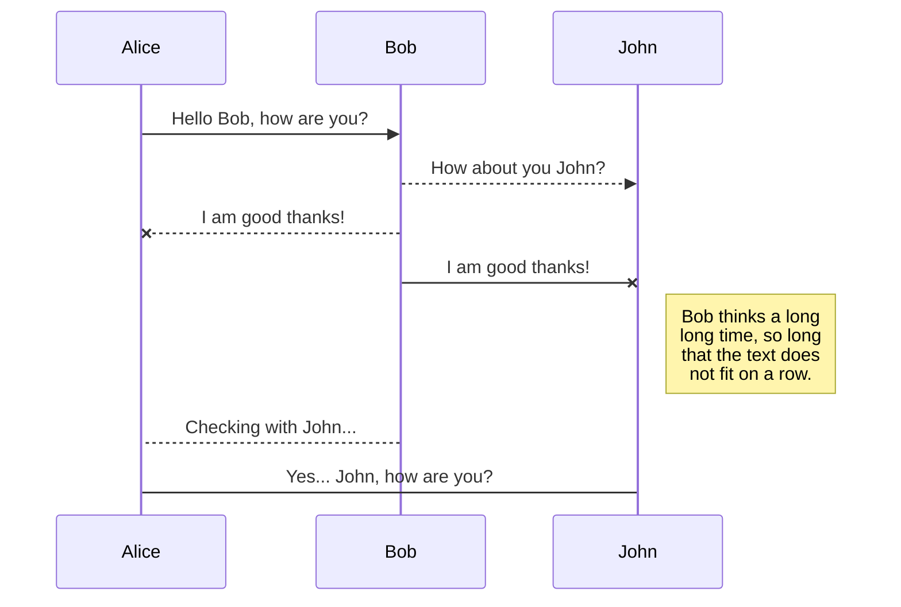

And this will produce a flow chart:

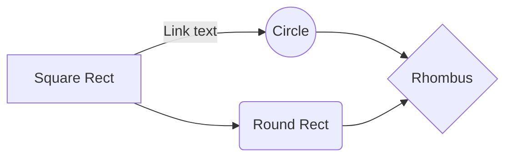
