# Building a Drone

Welcome to **Abu Villa** world of drone building! Crafting your own drone is not just a technical endeavor;  its a journey of creativity, innovation, and hands-on learning. In this guide, we`ll walk you through the exciting process of assembling your very own 5-inch drone.

# Parts List

| Component      |								 | Links                |
|----------------|-------------------------------|-------------------------|
|Frame			 |SpeedyBee Master 5 V2			 |		https://www.amazon.com/gp/product/B0CB6BTR4Z/ref=ewc_pr_img_1?smid=A1CA0481MF6RWW&psc=1		           |
|FC & ESC (stack)|SpeedyBee V3 F7 Stack			 |https://www.amazon.com/gp/product/B0B5QYXJNT/ref=ewc_pr_img_6?smid=A1CA0481MF6RWW&psc=1		          |
|Motors          |iFlight XING2 2306 1755KV 6S	 |https://www.amazon.com/gp/product/B0925DSVW2/ref=ewc_pr_img_10?smid=APE1PBQE6ZIBF&psc=1	           |
|Propellers      |Gemfan Hurricane               |https://www.amazon.com/gp/product/B09C8BZ27H/ref=ewc_pr_img_7?smid=A1DSGSQT9B8Q93&psc=1		           |
|Battery         |Gaoneng LiPo Drone Battery 1850mah 6S 100c XT-60					             |https://shopee.ph/Gaoneng-(GNB)-LiPo-Drone-Battery-1850mah-6S-100c-XT-60-i.59088184.12560887187?publish_id=&sp_atk=9a9aaaf1-2442-472e-bcd2-a91571376eca&xptdk=9a9aaaf1-2442-472e-bcd2-a91571376eca|
|GPS Module      |BN-220 Dual GPS Glonass Module |https://www.amazon.com/gp/product/B07PRDY6DS/ref=ewc_pr_img_6?smid=A1GUQD3SRXOFFI&th=1	           |
|Receiver        |RadioMaster RP1 2.4ghz w/ ELRS |https://www.amazon.com/gp/product/B0B93TCRGW/ref=ewc_pr_img_4?smid=A2TG3KYTBNKR2F&psc=1	           |
|Transmitter     |RadioMaster TX16S 2.4GHz		 |https://www.amazon.com/RadioMaster-TX12-EdgeTX-Multi-Module-2%EF%BC%88ELRS%EF%BC%89/dp/B0BFH5H14V/ref=sr_1_4?crid=1Q0J5M3FXWRK6&dib=eyJ2IjoiMSJ9.mBkiOj_RhH0MLO7cMcUaq6UNN1JV2Rhtj6hY6vFbahJQ-Imsuiu-sCq7TGOknp_cvyazT9Ppvqt_a4EAyhH2p9mpesTUj0p3l14xy8xHz6fB-QrG3eJWaNJRMJgMjKmmjyEWaGRUEl1ktBoBDF5lmlbYPRPfDk6aST_LiVtbZOJp4Tbr4Vyy_1Tmi469o_UKa6aTznqkiA8TKXdL-ZdbDQRJwVv2773tAzbIaRlKAvnfNSj5-GRansPB2hqqIWHcqoFKboDfVbLXtgrOLsJhNbkVLE8yCHoEs5CHfGtiCQY.uf8WPytaII5n0OTFKscd2be6HrkesxFIH6RcqoxfhCA&dib_tag=se&keywords=radiomaster+tx12&qid=1718251797&sprefix=Radio+Master+tx1%2Caps%2C295&sr=8-4	           |
|Goggles         |Skyzone Cobra X Goggles		 |https://www.amazon.com/Skyzone-1280x720-RapidMix-Receiver-Goggles/dp/B0CCNKNK9G/ref=sr_1_1_sspa?crid=SB96X8U3UVS3&dib=eyJ2IjoiMSJ9.9EBwDdKSKzPStXBGHrks370MxmgTaX17_B6zoIVZNExBgmcG7Ao4TlDMAf8SBdnP.z7WV0Ds62JTvMUieGKrjP1ql0Y2hX4qgHBQ896ObDlc&dib_tag=se&keywords=skyzone+cobra+x&qid=1718251843&sprefix=skyzone+cobra+x%2Caps%2C295&sr=8-1-spons&sp_csd=d2lkZ2V0TmFtZT1zcF9hdGY&psc=1	           |
|VTX             |AKK X2-Ultimate 5.8GHz		 |https://www.amazon.com/gp/product/B07DPG5H1T/ref=ewc_pr_img_9?smid=ADP3MHCS3NLR7&psc=1				           |
|Antenna         |FPV Antenna Lollipop 5.8G      |https://www.amazon.com/Foxeer-Antenna-Lollipop-Quadcopeter-Multicopter/dp/B07D12XS6K/ref=sr_1_1_sspa?crid=3H40EROAFCYAP&dib=eyJ2IjoiMSJ9.Jt7L3QrOmSnwUyMs3tuZ9-BmRc3TePqGHvE7ZdBD6FcXQUNYMsyfc6D4JfBLkJQqEX24WSGeuaHKh2dSWdtqsdhLRk8n59sdYep0s2JFIVCvLzXIrJAdusf19crQ6sTzYA47eZ9VaX1ICErh8J8tOkfXc0JYkd7U3Ayw60a1NfjvqeOnRghX5iTaaz3RrXloiENvj9o4ScNyndPtPh-v5qbgz83JuRpap_hoNmbjP8o.AHQJoK3edZam7vw3gsF3BoA_SmVNuPlKPxlgoqI7wF8&dib_tag=se&keywords=lollipop+antenna&qid=1718251658&sprefix=lollipop+ante%2Caps%2C318&sr=8-1-spons&sp_csd=d2lkZ2V0TmFtZT1zcF9hdGY&psc=1|
|Camera          |RunCam Phoenix 2				 |https://www.amazon.com/gp/product/B0C2TK5JGR/ref=ewc_pr_img_8?smid=A1CA0481MF6RWW&psc=1	           |

## Steps of Building FPV Drone
 - ## SpeedyBee Master 5 V2 Frame
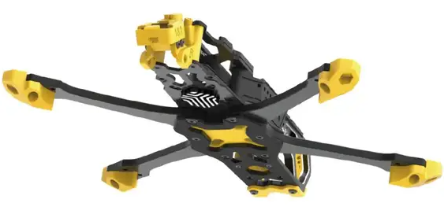

Installation Guidelines 

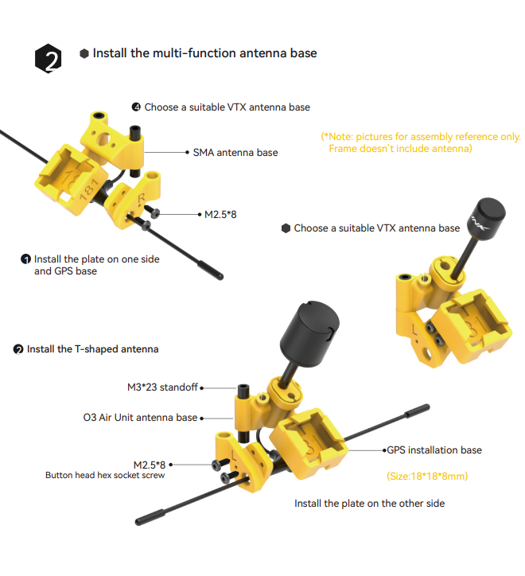
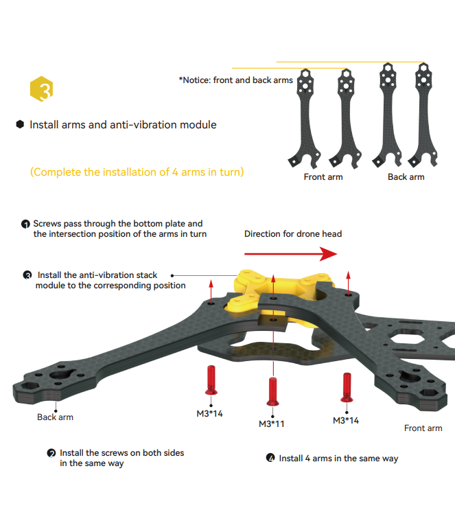
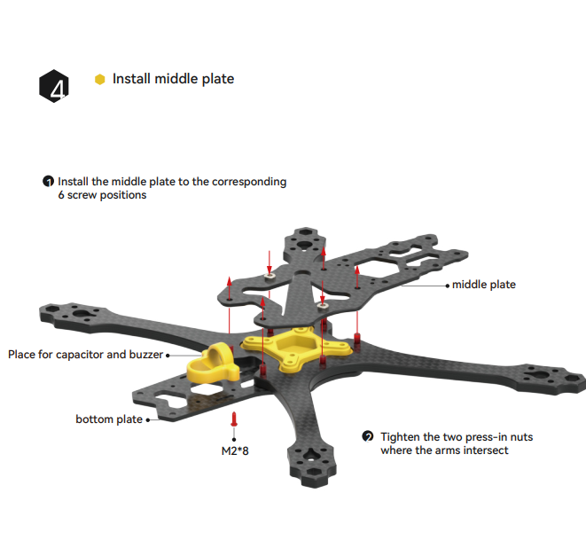
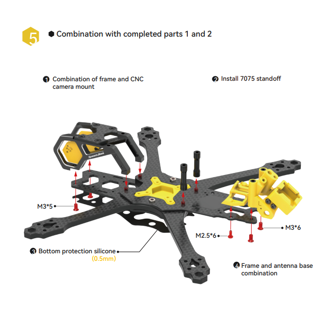
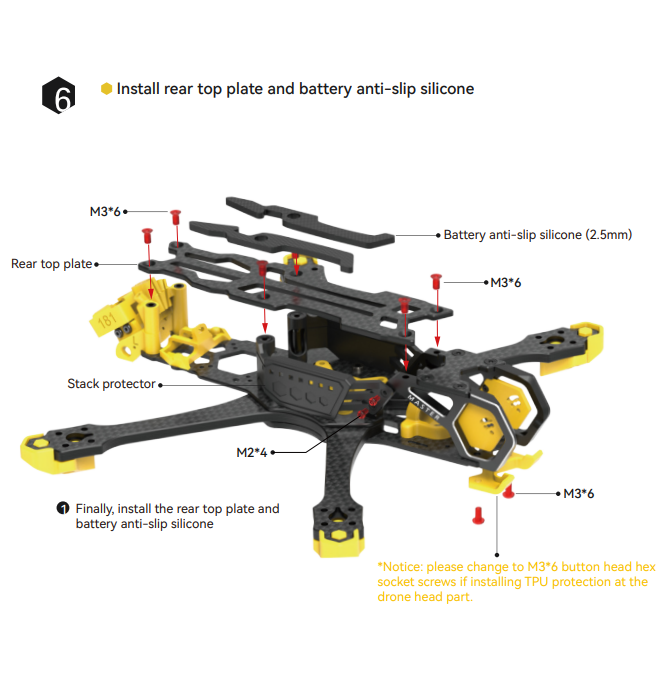
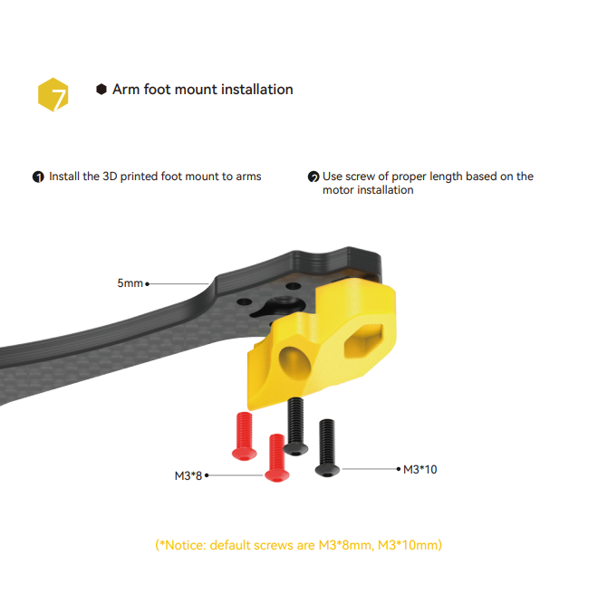
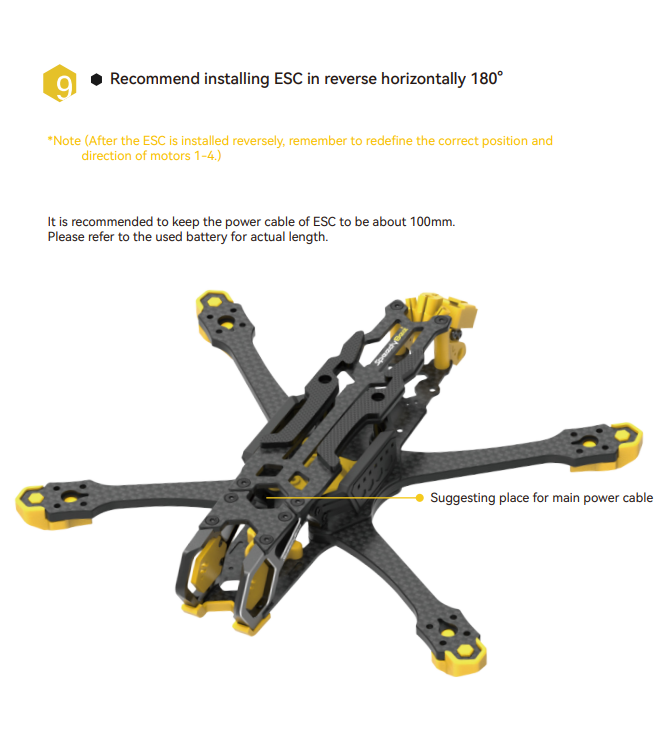

 - ## Wiring Diagram
Before proceeding, it’s a good idea to create a wiring diagram on a piece of paper outlining how to connect all the components. If you’re using the components I recommended, here are connection diagrams you can follow.
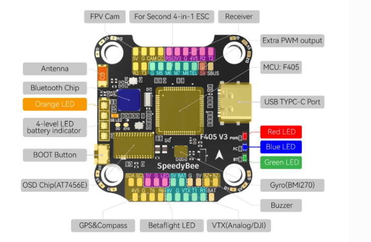

## 1. Installing ESC  
Begin by replacing the four shorter screws in the frame with the long M3 30mm bolts that come with the Speedybee F405 V3 stack. Avoid using nylon standoffs for installing FC, ESC and VTX, they break easily in crashes. Use metal bolts instead.
Use metal bolts for installing stack (with a metal nut at the botttom), it reduces vibration and wobble, makes the drone fly better and easier to tune.

- Slide the 4in1 ESC and FC boards onto the four long screws, ensuring the ESC board’s power pads face backward and the motor solder pads face up. The front of the frame is identifiable by the cut-outs for the camera mounting plates.
- Inspect the bottom of the ESC to ensure it’s not touching the frame. Additionally, check for any contact between the ESC and FC.
Next, you’ll do some soldering
## 2. Installing Motors 
 
- Determine the required motor wire lengths, leaving a little slack, and cut them accordingly. Secure the motor wires on the arms with cloth tape or electrical tape.
- Then, strip about 2mm off the tip of the wires and tin the ends.
- Using the trimmed off motor wires, solder two of them to the input power of the ESC (ideally on the bottom side). Mark the positive wires with a piece of tape to solder the capacitor to later. 
- Tin all the solder pads on the 4in1 ESC. To prevent solder from accidentally dropping onto the components and causing electrical shorts, cover the areas of the board where you’re not soldering with tape, such as electrical tape, kapton tape, or masking tape.

Solder the motor wires onto the ESC. Don’t worry about wire order and motor direction yet; you can change this later in the software. If you have the skills, you could try to solder motor wires side way, make it nicer to grab the quad.

Solder the XT60 power lead to the power pads on the ESC, making sure to maintain the correct polarity (positive and negative). This step may be challenging due to the amount of heat required to melt the solder on the large copper pads. Be patient and use a higher temperature on your iron.

Soldering Tips:
- Use a good amount of solder and solder flux (solder paste) for the large pads, ensuring the solder joints are shiny and full. If you can see the wire strands, you haven’t applied enough solder.
- Apply more flux if the solder “sticks” to the tip when you remove it from the joint.
- Feel free to use a high temperature when soldering large solder pads, but be quick and avoid overheating the pads for too long. Use 450°C (840°F) for motor wires and XT60, and 380°C for signal wires.
- Now solder the 1500uF capacitor that comes with the Speedybee stack. Bend and shorten the legs with pliers, then tin them with solder.
- Solder the capacitor to the wires connected to the ESC power pads earlier, being mindful of the polarity. The side with yellow marking is the negative side of the capacitor.

## 2. Installing Camera
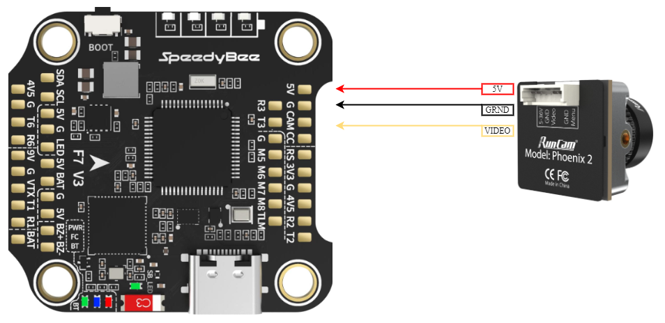
- Solder the CAMERA wires connect to the flight controller **5v, ground, cam** pads.

## 3. Installing GPS to Flight Controller
Wiring a GPS module to the flight controller is quite straightforward. Simply connect it directly to any available UART on the FC, (TX to RX, RX to TX), and power it with 5V.
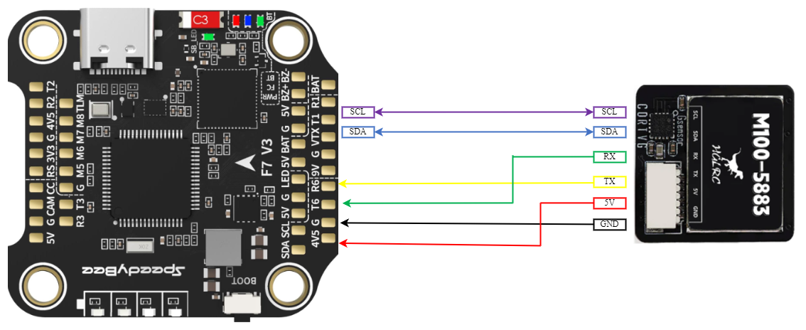
- Solder the **5v** wire of the gps to the **4v5** pad of the FC 
- Solder the **G** wire of the GPS to the **G** pad of the FC
- Solder the **TX** wire of the gps to the **T6** pad of the FC
- Solder the **RX** wire of the gps to the **R6** pad of the FC
- Solder the **SDA** wire of the gps to the **SDA** pad of the FC (if GPS has a compass/barometer) 
- Solder the **SCL** wire of the gps to the **SCL** pad of the FC (if GPS has a compass/barometer)

## 3. Installing Receiver
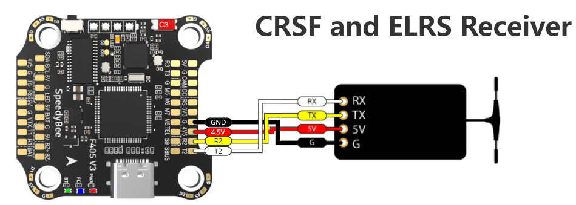
- Solder the **5v** wire of the receiver  to the **4v5** pad of the FC
- Solder the **G** wire of the receiver  to the **G** pad of the FC
- Solder the **RX** wire of the receiver  to the **T2** pad of the FC
- Solder the **TX** wire of the receiver  to the **R2** pad of the FC

## 3. Installing VTX
 
- Solder the **7-26v** wire of the vtx  to the **9v** pad of the FC
- Solder the **G** wire of the vtx  to the **G** pad of the FC
- Solder the **Video** wire of the vtx  to the **VTX** pad of the FC
- Solder the **Smart Audio(SA)** wire of the recvtxeiver  to the **T1** pad of the FC

## Software

Inav is a flight control software, which was forked from Clean Flight. The software supports both multi-rotors and fixed wings and has good GPS modes like Return to launch (RTH) etc. The software has a mission planner, which allows for setting full autopilot GPS way-point navigation. It supports a variety of Flight controller boards and is actively being developed by the community.

## Download iNav Configurator
- Download the latest iNav Configurator here: https://github.com/iNavFlight/inav-configurator/releases

## Checking iNav Compatibility
- Before proceeding, verify if your flight controller is compatible with iNav.
In the iNav Configurator, on the Firmware Flasher page, search for your FC’s firmware target. If it’s listed, congratulations, you can proceed to the next step. If not compatible, consider getting a new FC, such as the Speedybee F405 V4 – an affordable, feature-rich option ideal for an iNav drone build.

 

 ## Flashing  INAV
 - First if you have an existing setup in Betaflight you need to backup your setup before you proceed INAV, Then if you have done backup you setup in BetaFlight.  Select the firmware target for your FC. Note that the Auto-select button may not work if your FC is still running Betaflight.

Enable “Full chip erase” and leave the other options unchecked. 

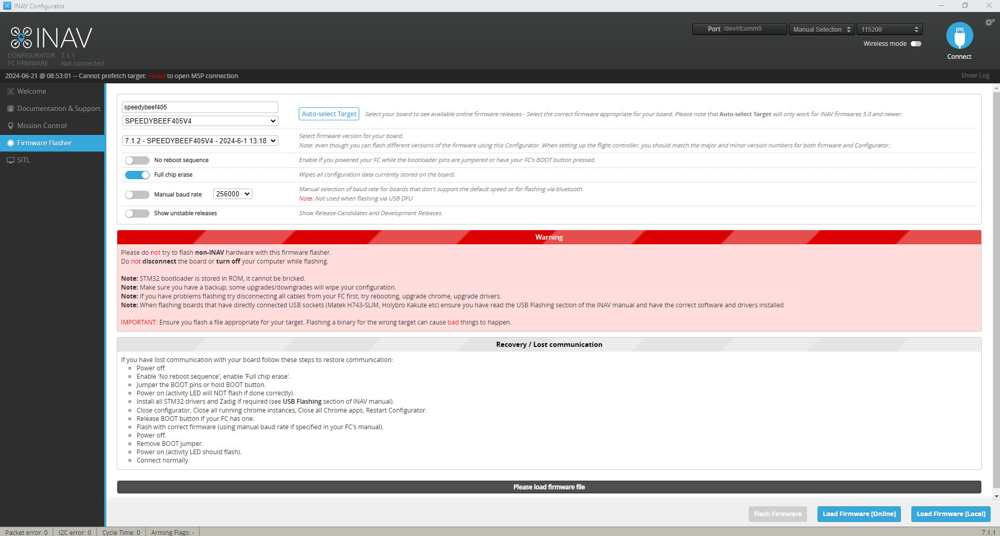

## Default Values
- After installing iNav, you’ll be prompted to choose a preset that most closely matches your quad, such as 3-inch, 5-inch, or 7-inch quad.
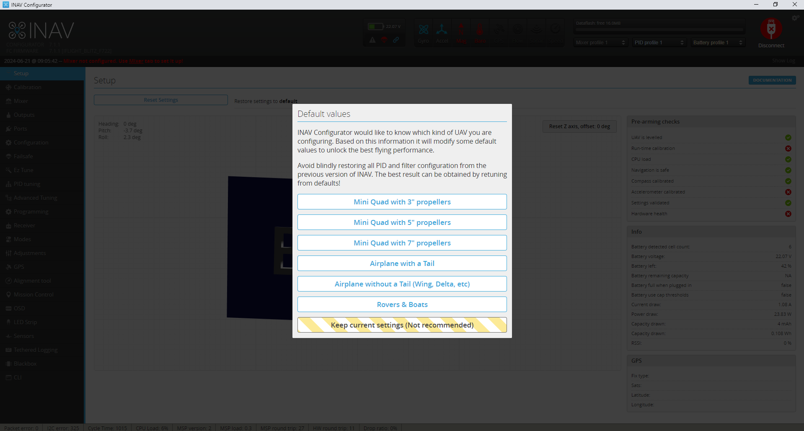

## Setup Tab
- In the first page – Setup, you can view the status of your drone.
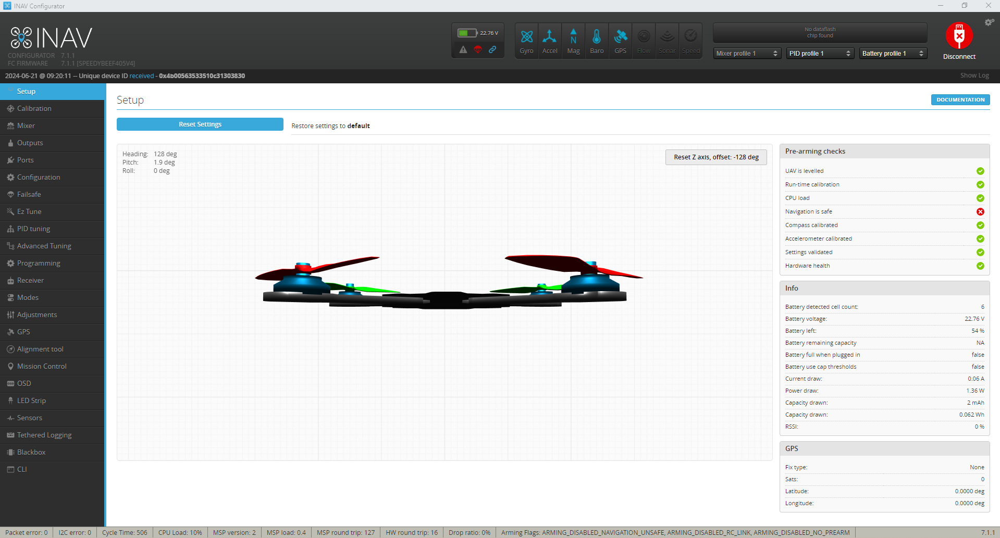

## Board Orientation

Hold the drone in your hand, point the camera towards the computer screen, and click the “Reset Z-Axis” button. Now move the drone around and see if the 3D model moves exactly as you do.

Troubleshooting:
- If the 3D model is inverted (upside down), and you have a red cross next to “UAV is levelled” in pre-arming checks, you can fix this in the board alignment tool, e.g., enter 180 in roll.
- If the drone moves in the opposite direction because the FC is rotated, you can also correct this in the board alignment tool, e.g., enter 180 in yaw.

## Calibration Tab

Here we will calibrate the accelerometer.

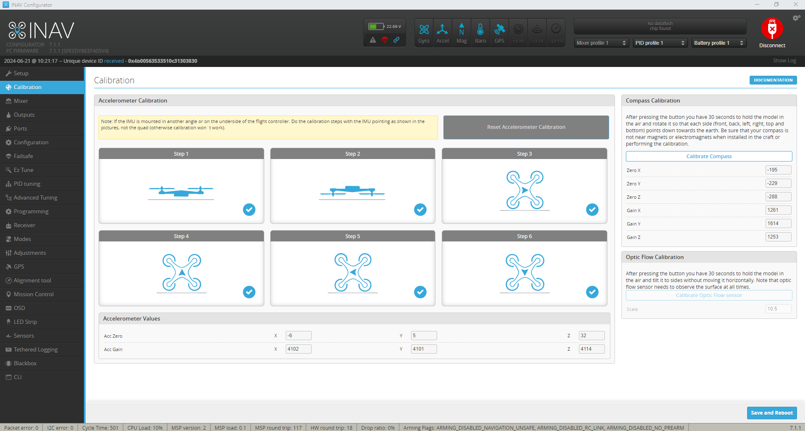

Place the drone on a level surface and go through the 6-step calibration. Note that for every step, you need to click the “Calibrate Accelerometer” button.

It might seem a bit complicated at first, but don’t be afraid to start over if needed. The calibration doesn’t have to be super precise—just do your best to position the quad in each intended position.

##Mixer Tab

Normally, you shouldn’t need to change anything here since the “Default Values” should have applied these settings for you. However, it’s good practice to double-check.

- Platform: “Multirotor”.
- Mixer preset: “Quad X”.

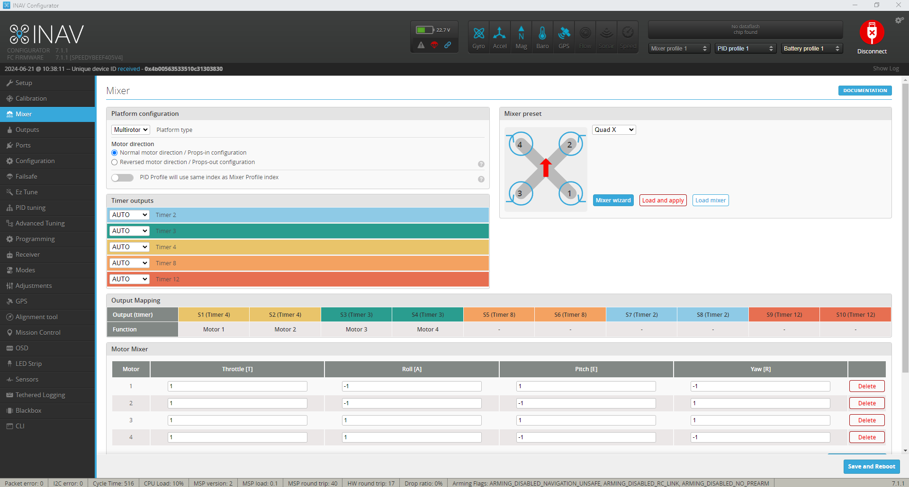

If you want to run reverse motor direction (props out), select “Reversed motor direction / Props-out configuration”.

Click Save and Reboot.

## Outputs Tab

This tab functions similarly to the Motors tab in Betaflight.

Note that motor outputs are disabled by default in iNav, a safety feature that differs from Betaflight. Motors WILL NOT work until you manually enable the “Enable motor and servo output” option.

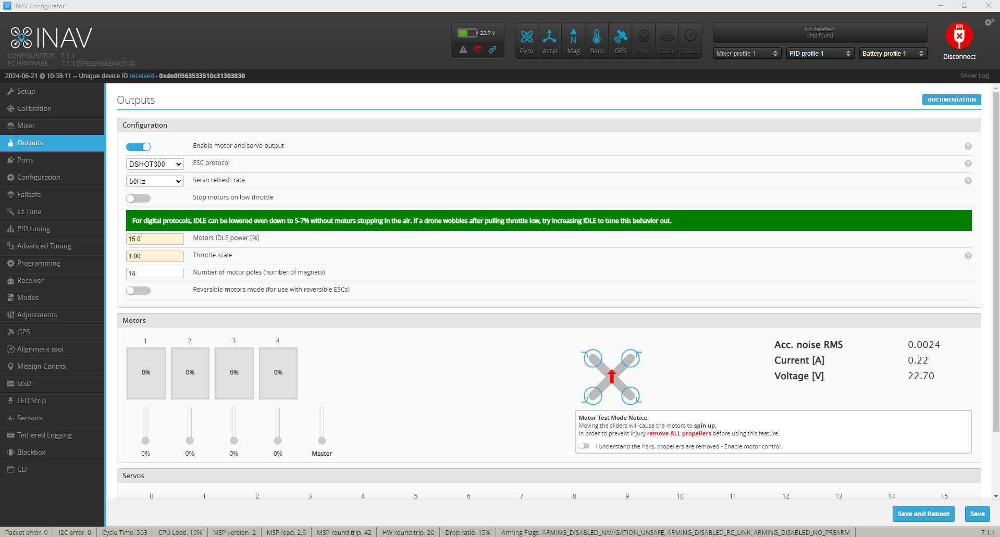

In the Outputs tab, select DShot300 as the ESC protocol.

I personally set a default Motor Idle Power % for 7-inch quads.
Since default in iNav is high Idle Power, which is more suited for larger drones with high power.

Click Save and Reboot. Power cycle the FC by unplugging both the USB cable and battery.

**Warning:** Ensure to remove propellers before proceeding to the next step.

Now, test the motors using the sliders in the Outputs tab to check if they spin, and if they spin in the correct direction.

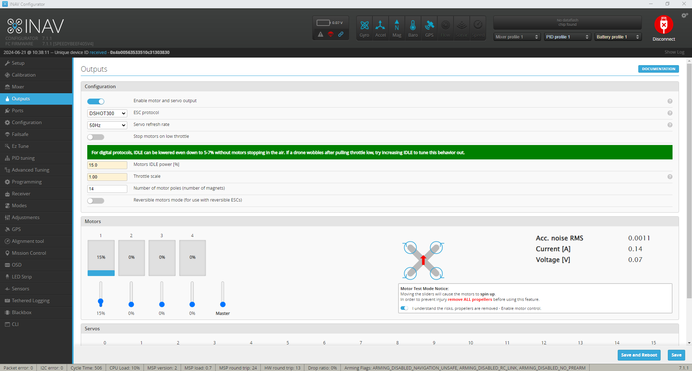

**Troubleshoot: What if the motor order is wrong?** 
Unlike Betaflight, iNav does not support resource remapping. To change motor order, you can adjust settings in the Mixer tab. Remember, after making changes, just hit Save and Reboot—there’s no need to click LOAD and APPLY. After changing the motor order in the Mixer, it won’t reflect in the outputs tab, but you should conduct a test hover to make sure it works correctly.

## Ports Tab
Setting up ports in iNav should feel familiar to those used to Betaflight. If you’ve taken screenshots from Betaflight, you can simply replicate the setup here.

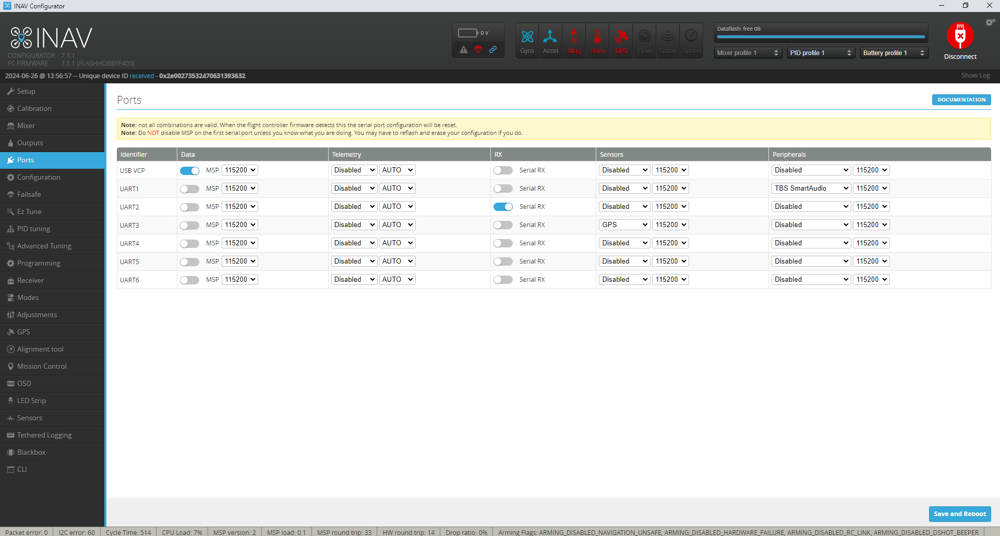

## Configuration Tab
In the Configuration tab, you can select the sensors connected to the flight controller, such as GPS, compass, barometer, optical flow sensor, etc.

## How to bind receiver to transmitter?
Here are the steps for binding a traditional RC receiver to a transmitter using the "plug in the battery 3 times" method.

1. Prepare the transmitter:
    - Turn on the transmitter
    - Click "Sys" button on the right side of the transmitter
    - Select ExpressELRS
    - Locate the "BIND" labeled on the transmitter.
2. Prepare the Receiver:
    - Disconnect the receiver from any power source.

3. Enter Binding Mode:
    - Plug in the receiver's battery three times, pausing for a few seconds between each connection.
    - On the third connection, the receiver's LED should start blinking, indicating it is in binding mode.

4. Initiate Binding on the Transmitter:
    - Press the "BIND" labeled on the transmitter.

5. Wait for Successful Binding:
    - The transmitter and receiver will now communicate and establish a connection.
    - Once the binding is successful, the receiver's LED will typically change to a solid pattern.

6. Verify the Connection:
    - Move the transmitter's controls and observe the corresponding movements on the connected devices (e.g., servos, motors) on the receiver tab in INAV.

## Receiver Tab
For ExpressLRS or Crossfire receivers, select SERIAL as the receiver type, and CRSF as the receiver provider. Click Save and Reboot.

Now, you can test the radio link to ensure the channel values correctly respond to your radio stick movements. If the channel order is wrong, try a different channel map.

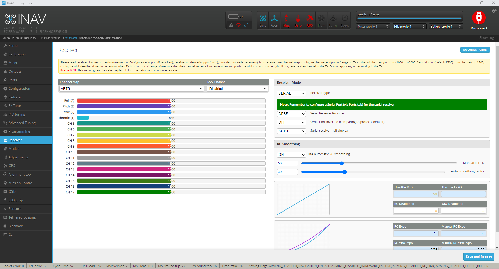

I recommend setting “Use automatic RC smoothing” to ON, then adjusting the auto smoothing factor to fine-tune response to stick movements. This is particularly beneficial for radio links with dynamic refresh rates, such as ExpressLRS and Crossfire.